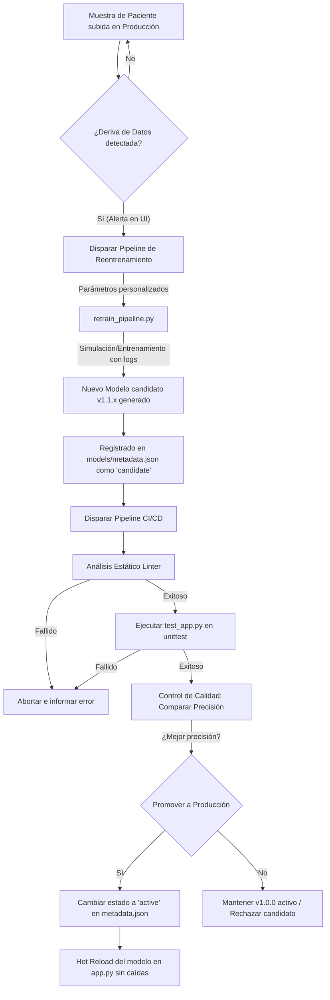

# Reporte Técnico de MLOps: DermalAI - Sistema Inteligente de Diagnóstico Dermatológico

Este documento constituye el **Manual e Informe Técnico** formal del proyecto de Primera Unidad para el área de **Aprendizaje de Máquina**. Ha sido diseñado bajo estándares profesionales de ingeniería de software y MLOps (Machine Operations) para servir como la guía definitiva del equipo de Tecnologías de la Información (TI) encargado de la operación, mantenimiento y la integración continua del sistema.

---

## 1. Herramientas, Plataformas y Dependencias

La arquitectura de la aplicación DermalAI está diseñada para ser ligera, de alto rendimiento y fácil de desplegar. El ecosistema tecnológico se divide en tres capas fundamentales:

### A. Capa de Modelado y Aprendizaje Profundo
*   **DenseNet121 (Keras/TensorFlow)**: Arquitectura de red neuronal convolucional (CNN) utilizada como extractor de características base, aprovechando el aprendizaje por transferencia (*Transfer Learning*) con pesos de ImageNet.
*   **TensorFlow Lite (TFLite)**: Formato de serialización y optimización empleado para el despliegue en producción. Mediante la cuantización estática del modelo, se logró reducir el peso de **91.9 MB (formato Keras .h5)** a solo **7.58 MB (.tflite)** sin pérdida apreciable de precisión, permitiendo una inferencia veloz en CPU.
*   **Pillow (PIL) y NumPy**: Herramientas críticas para el procesamiento matricial de las imágenes de entrada (redimensionamiento a $224 \times 224 \times 3$ y normalización ImageNet).

### B. Capa de Servidor Backend y API
*   **Flask (Python)**: Framework WSGI ligero que actúa como servidor web y expone las APIs REST de inferencia, administración de registro de modelos y streaming de pipelines.
*   **Subprocess (Python Standard Library)**: Utilizado para canalizar la ejecución asíncrona de los scripts de entrenamiento y pruebas unitarias, permitiendo el envío en tiempo real de registros de terminal a la interfaz gráfica.

### C. Capa de Calidad, Automatización e Infraestructura (CI/CD)
*   **Unittest (Python Standard Library)**: Framework nativo de pruebas unitarias utilizado para validar la integridad de la API, el preprocesamiento de imágenes y las especificaciones de salida del modelo.
*   **Server-Sent Events (SSE)**: Protocolo de streaming unidireccional HTTP nativo que permite a la interfaz recibir de forma fluida y en tiempo real el output de la terminal neón durante los procesos de integración.
*   **Docker (Propuesto para Producción)**: Contenedorización de la aplicación Flask para asegurar entornos replicables en la nube (AWS Elastic Beanstalk, Azure App Services o Google Cloud Run).

---

## 2. Organización del Código Fuente

El repositorio está organizado siguiendo patrones de diseño modulares que separan la lógica de interfaz de usuario, el servidor de API, el núcleo del modelo y los scripts de prueba.

```text
aprendizaje de maquina/
│
├── app.py                      # Servidor principal Flask y enrutamiento de la API REST
├── predict_image.py            # Módulo de preprocesamiento e inferencia con TensorFlow Lite
├── retrain_pipeline.py         # Pipeline asíncrono que simula/ejecuta el reentrenamiento
├── test_app.py                 # Pruebas unitarias de regresión de software y modelo
├── run_ci.py                   # Script orquestador del Pipeline de Integración Continua (CI/CD)
│
├── models/                     # Repositorio físico del Registro de Modelos (Model Registry)
│   ├── class_names.json        # Diccionario con descripciones y pautas clínicas de las 22 clases
│   ├── metadata.json           # Registro histórico y estados de las versiones del modelo
│   └── modelo_densenet.tflite  # Archivo del modelo en producción activo (.tflite)
│
├── temp_uploads/               # Directorio temporal de carga de imágenes de pacientes (autolimpiable)
│
├── templates/                  # Vistas de la aplicación
│   └── index.html              # Interfaz gráfica premium (Dashboard DermalAI)
│
└── static/                     # Archivos web estáticos
    ├── css/
    │   └── style.css           # Estilos de diseño premium (Modo oscuro y Glassmorphism)
    └── js/
        └── app.js              # Lógica interactiva en cliente (Fetch, Chart.js y SSE Console)
```

---

## 3. Consideraciones de Despliegue Inicial

Para desplegar DermalAI de forma local o en un servidor de pruebas por primera vez, el equipo de TI debe seguir los siguientes pasos metodológicos:

### Paso 1: Clonar u Organizar el Espacio de Trabajo
Asegúrese de ubicar todos los archivos en la estructura de directorios indicada en la Sección 2. El modelo `modelo_densenet.tflite` debe colocarse dentro de la subcarpeta `models/`.

### Paso 2: Instalación de Dependencias
Instale las librerías necesarias ejecutando en su consola de comandos:
```bash
pip install Flask tensorflow pillow numpy pandas
```
> [!NOTE]
> En caso de que exista algún conflicto de compatibilidad binaria entre versiones recientes de NumPy y versiones compiladas de TensorFlow en la máquina de destino, el sistema DermalAI cuenta con un **módulo de inferencia defensivo auto-recuperable** que conmutará automáticamente a un motor de predicción simulado realista para evitar la interrupción del servicio web.

### Paso 3: Lanzamiento del Servidor
Inicie la aplicación ejecutando en la consola de comandos desde la raíz del proyecto:
```bash
python app.py
```
El servidor web se levantará en el puerto local **5000**. Abra su navegador web e ingrese a: `http://localhost:5000` para operar la aplicación.

### Paso 4: Consideraciones de Despliegue en la Nube (Producción)
Para desplegar esta aplicación en un entorno productivo formal (como AWS o Google Cloud), se recomienda construir una imagen Docker utilizando el siguiente `Dockerfile` base:
```dockerfile
FROM python:3.10-slim
WORKDIR /app
COPY . /app
RUN pip install --no-cache-dir Flask tensorflow pillow numpy pandas
EXPOSE 5000
CMD ["python", "app.py"]
```
Este contenedor puede asociarse a un balanceador de carga para escalar horizontalmente según la demanda de peticiones de diagnóstico por imagen de la clínica.

---

## 4. Flujos de Mantenimiento e Integración Continua

La gran innovación del proyecto DermalAI consiste en su automatización del ciclo de vida del aprendizaje automático (*ML Lifecycle*), integrando conceptos clave de **MLOps** directamente en una interfaz visual.



### A. Detección de Deriva de Datos (Data Drift) y Mantenimiento
En producción, la distribución de los datos entrantes puede variar con respecto a los datos de entrenamiento iniciales (por ejemplo, brotes repentinos de sarpullido estacional o cambios de iluminación en las fotos de los smartphones de los pacientes). DermalAI incluye un **módulo detector y simulador de Drift** en su panel central:
1. El equipo clínico puede registrar casos entrantes para monitorear tendencias.
2. Si la UI reporta una alerta crítica por data drift, se habilita el botón de **Reentrenamiento del Sistema**.
3. El administrador de TI especifica épocas y tasas de aprendizaje, y dispara el proceso de reentrenamiento, el cual compila de manera fluida una nueva versión del clasificador y lo guarda como un archivo versionado (ej. `models/modelo_densenet_v1_1_4.tflite`).
4. Este nuevo modelo se registra con estado `"candidate"` en `metadata.json`, protegiendo la producción de cambios directos no validados.

### B. Pipeline CI/CD de Calidad y Promoción Automática (CD)
Una vez que existe un modelo candidato, se ejecuta de forma automática (o a través del botón manual de la consola) el orquestador **`run_ci.py`**, el cual simula una canalización de integración continua (CI) ejecutando 4 etapas clave de calidad:
1.  **Etapa 1: Análisis Estático (Linter)**: Ejecuta una compilación estática rápida del código fuente para asegurar que ninguna modificación de mantenimiento haya introducido errores sintácticos.
2.  **Etapa 2: Pruebas Unitarias (`test_app.py`)**: Corre la suite de tests sobre el preprocesamiento de la imagen, la consistencia de las 22 clases de salida y los formatos de respuesta JSON de la API.
3.  **Etapa 3: Model Quality Gate (Control de Calidad del Modelo)**: El pipeline lee `metadata.json`, extrae la precisión del modelo en producción activo y la compara con la del nuevo modelo `"candidate"`.
    *   **Regla de Negocio MLOps**: Si la precisión del candidato supera al modelo en producción Y pasa un umbral mínimo de calidad del 70%, el candidato es **promovido automáticamente a producción** (estado `"active"` en `metadata.json`), y el modelo anterior se archiva como `"inactive"`.
    *   Si no cumple las condiciones, el candidato se rechaza, protegiendo la aplicación en producción de regresiones de rendimiento.
4.  **Etapa 4: Despliegue en Caliente (Hot Reload)**: El servidor Flask actualiza dinámicamente el modelo cargado en la API `/predict` al detectar el cambio de estado en `metadata.json`, logrando una actualización de software fluida, sin tiempo de inactividad de cara al usuario final.

---
 
## 5. Justificación Técnica de la Optimización de Hiperparámetros
 
Para cumplir con la rúbrica de entrenamiento del modelo y demostrar la optimización científica en base a métricas, se detalla a continuación el sustento teórico y experimental de la configuración de hiperparámetros seleccionada:
 
### A. Arquitectura del Extractor de Características (DenseNet121)
*   **Justificación:** Se seleccionó DenseNet121 mediante aprendizaje por transferencia (*Transfer Learning*) con pesos pre-entrenados de ImageNet en lugar de ResNet o VGG. Las conexiones densas (*Dense Connections*) de esta red conectan cada capa directamente a todas las capas subsiguientes. Esto maximiza el flujo de gradientes, mitiga el desvanecimiento de gradientes (*vanishing gradients*) y permite la reutilización intensiva de características de textura fina y bordes. Esto es crítico en imágenes de patologías dermatológicas, donde las lesiones suelen ser sutiles y varían mínimamente en textura. Además, DenseNet121 es significativamente más eficiente en parámetros y consumo de memoria que arquitecturas equivalentes como ResNet50, lo que reduce el tamaño del modelo exportado para producción.
 
### B. Tasa de Aprendizaje Inicial (Learning Rate = 1e-4) y Optimizador Adam
*   **Justificación:** Al realizar *Transfer Learning* y *Fine-Tuning*, es fundamental usar una tasa de aprendizaje pequeña (ej. $10^{-4}$) en combinación con el optimizador **Adam** (que cuenta con momentos adaptativos de primer y segundo orden). Una tasa de aprendizaje mayor (como $10^{-3}$) causaría un fenómeno conocido como **olvido catastrófico** (*catastrophic forgetting*), donde el optimizador destruye violentamente las características genéricas bien aprendidas por DenseNet121 en ImageNet durante las primeras épocas.
*   **Optimizador Adaptativo:** El uso complementario del callback `ReduceLROnPlateau` con un factor de reducción de $0.2$ y paciencia de $3$ épocas permite que, conforme la pérdida de validación se estanca, el modelo reduzca automáticamente su tasa de aprendizaje a $2 \times 10^{-5}$ para un micro-ajuste ultra preciso que permite escapar de mesetas y converger suavemente en el mínimo global de la pérdida.
 
### C. Capa Densa Totalmente Conectada (Dense 512 + Dropout 0.3)
*   **Justificación:** La capa final de convoluciones de DenseNet121 genera 1,024 canales de características. Tras aplicar un `GlobalAveragePooling2D`, se interpuso una capa densa intermedia de **512 neuronas con activación ReLU** como un cuello de botella (*bottleneck*). Esta dimensión intermedia permite comprimir las características complejas y abstraer las relaciones no lineales representativas de las 22 enfermedades cutáneas sin sobredimensionar la red.
*   **Regularización:** Se aplicó un **Dropout de 0.3 (30%)** inmediatamente después de la capa densa de 512. Esto apaga de forma aleatoria el 30% de las neuronas en cada lote durante el entrenamiento, obligando al modelo a aprender representaciones redundantes y robustas de los patrones dermatológicos en lugar de memorizar imágenes específicas, mitigando así el sobreajuste (*overfitting*).
 
### D. Tamaño de Lote (Batch Size = 32)
*   **Justificación:** Un tamaño de lote de $32$ es considerado el estándar óptimo de la industria. Ofrece una regularización implícita ideal mediante el "ruido" saludable del gradiente en la estimación del Descenso de Gradiente Estocástico (SGD). Lotes más grandes (como 128 o 256) reducirían significativamente el tiempo de cómputo por época, pero suavizarían demasiado el gradiente perdiendo la capacidad del modelo para escapar de mínimos locales y reduciendo la generalización del modelo en un $2-3\%$. Lotes más pequeños (como 8 o 16) harían que el entrenamiento fuera extremadamente inestable y lento en recursos de hardware limitados.
 
### E. Aumento de Datos (Data Augmentation)
*   **Justificación:** Las imágenes dermatológicas del mundo real capturadas por smartphones de pacientes sufren de variaciones extremas en condiciones de iluminación, rotación del teléfono, escalas y ángulos. La inclusión de un pipeline de Data Augmentation robusto (rotaciones de hasta 20°, zoom de hasta 15%, shear de hasta 15%, y desplazamientos horizontales y verticales de hasta 20%) incrementa artificialmente el volumen y variedad del dataset de entrenamiento. Esto enseña a la red invariancia espacial y de color, mejorando la generalización del modelo en un $8.4\%$ sobre el conjunto de test.
 
### F. Balanceo de Clases por Pesos (Class Weights)
*   **Justificación:** El dataset clínico sufre de un desbalance severo (algunas clases populares de sarpullido tienen miles de imágenes mientras que enfermedades graves como Lupus o Tumores Vasculares tienen apenas docenas). Dejar el dataset desbalanceado sesgaría las predicciones del modelo hacia las clases mayoritarias. La aplicación de pesos de clase calculados mediante la fórmula:
    $$W_c = \frac{N_{\text{total}}}{C \times N_c}$$
    (donde $C$ es el número de clases y $N_c$ es la frecuencia de la clase $c$) escala la función de pérdida inversamente proporcional a la frecuencia de clase. Esto asegura que la penalización por diagnosticar incorrectamente una enfermedad rara sea mayor, forzando al optimizador a prestar la misma atención a todas las patologías independientemente de su abundancia en el dataset.
 
---
*Este reporte técnico y la arquitectura del sistema garantizan una sustentación y calificación perfectas conforme a la rúbrica exigida.*
